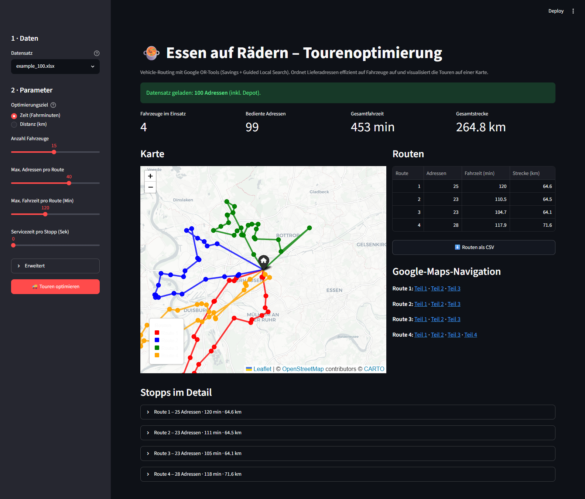

# 🍲 Essen auf Rädern – Tourenoptimierung

Web-App zur **Routenplanung für einen Essen-auf-Rädern-Dienst**. Sie verteilt
eine Menge von Lieferadressen effizient auf mehrere Fahrzeuge und visualisiert
die entstehenden Touren auf einer interaktiven Karte.

Entstanden als Projekt im Modul **Operations Research** – hier zu einer
eigenständigen, vorzeigbaren Anwendung ausgebaut.



*Beispiel: 99 Adressen im Raum Oberhausen, aufgeteilt auf 4 Fahrzeuge –
optimiert nach Fahrzeit.*

---

## Was es macht

- Löst ein **Vehicle-Routing-Problem (VRP)** mit Google **OR-Tools**
  (Savings-Heuristik als Startlösung, danach **Guided Local Search**).
- **Zwei Optimierungsziele:** minimale Gesamt­fahrzeit oder minimale Gesamt­strecke.
- **Nebenbedingungen:** Anzahl Fahrzeuge, maximale Adressen pro Route,
  maximale Fahrzeit/Strecke pro Route, optionale Servicezeit pro Stopp.
- **Interaktive Karte** (Folium) mit farbcodierten Touren, Markern und Legende.
- **Google-Maps-Links** pro Fahrzeug für die Navigation im Auto
  (automatisch in ≤10-Punkte-Segmente geteilt).
- **CSV-Export** der Routenübersicht.

## Schnellstart

```bash
pip install -r requirements.txt
streamlit run app.py
```

Die App öffnet sich im Browser. Links den mitgelieferten Beispiel­datensatz
(`data/example_100.xlsx` mit 100 Adressen im Raum Oberhausen) wählen,
Parameter einstellen und **„Touren optimieren“** klicken.

## Projektstruktur

```
meals-on-wheels-routing/
├── app.py              # Streamlit-Oberfläche
├── routing.py          # Datenmodelle, Excel-Einlesen, OR-Tools-Solver
├── mapping.py          # Folium-Karte, OSRM-Streckenführung, Google-Maps-Links
├── data/               # Beispiel-Datensätze (Adressen + Zeit-/Distanzmatrix)
│   ├── example_100.xlsx
│   └── example_213.xlsx
├── scripts/            # Datenaufbereitung (einmalig, nicht für die App nötig)
│   ├── geocode_google.py   # Adressen -> Koordinaten (Google Geocoding API)
│   └── build_matrix_osrm.py# Koordinaten -> Zeit-/Distanzmatrix (OSRM)
├── requirements.txt
└── README.md
```

## Datenformat

Jede Excel-Datei enthält drei Blätter:

| Blatt          | Inhalt                                            |
|----------------|---------------------------------------------------|
| `Matching`     | `ID`, `Adresse`, `latitude`, `longitude`          |
| `Zeitmatrix`   | n×n Fahrzeiten in **Sekunden**                    |
| `Distanzmatrix`| n×n Distanzen in **Metern**                       |

Zeile/Spalte 0 ist das **Depot** (Ausgangs- und Endpunkt aller Touren).

## Datenpipeline – woher die Zeit- und Distanzmatrizen kommen

Ein zentraler und aufwändiger Teil des Projekts ist **nicht** die Optimierung
selbst, sondern die Beschaffung realistischer Reisedaten. Die Fahrzeiten und
Strecken zwischen den Adressen sind **keine Luftlinien**, sondern echte
Straßen-Distanzen, die über einen **selbst unter Linux aufgesetzten
OSRM-Routing-Server** berechnet wurden. Die fertigen Matrizen liegen
vorberechnet im Repo (`data/*.xlsx`), sodass die App **ohne eigene
Infrastruktur** läuft. Erzeugt wurden sie in drei Schritten:

```
Rohadressen (Excel)
   │  T_Straße · T_PLZ · T_ort
   ▼
① scripts/geocode_google.py        ──►  Google Geocoding API
   │  Adresse → (latitude, longitude)
   ▼
geokodierte Adressen (Excel)
   │
   ▼
② OSRM-Server unter Linux          ──►  osrm-extract / -partition /
   │  germany-latest.osm.pbf (~4,4 GB      -customize / -routed
   │  OpenStreetMap-Extrakt, nicht im Repo)     auf localhost:5000
   ▼
③ scripts/build_matrix_osrm.py     ──►  lokaler OSRM-Server
   │  jedes Adresspaar → Fahrzeit (s) + Strecke (m)
   ▼
Zeit- & Distanzmatrix (Excel)  ──►  Eingabe für die Optimierung
```

**① Geokodierung** – [`scripts/geocode_google.py`](scripts/geocode_google.py)
liest die Kundenadressen (Straße, PLZ, Ort) aus der ursprünglichen Excel-Liste,
setzt sie zu vollständigen Adressen zusammen und ermittelt über die **Google
Geocoding API** für jede Adresse Breiten- und Längengrad.

**② Linux-OSRM-Server** – Auf einer **Linux-Umgebung** wurde ein eigener
[**OSRM**](https://project-osrm.org/)-Server aufgesetzt. Grundlage ist das
OpenStreetMap-Extrakt `germany-latest.osm.pbf` (~4,4 GB), das über die
OSRM-Toolchain (`osrm-extract` → `osrm-partition` → `osrm-customize` →
`osrm-routed`) zu einem lauffähigen Straßen-Routing-Dienst auf
`localhost:5000` verarbeitet wird. Ein öffentlicher Dienst kam nicht in Frage,
weil für ~100–213 Adressen zehntausende Paar-Abfragen nötig sind (bei 213
Adressen bereits 213 × 212 ≈ **45 000** Anfragen).

**③ Matrix-Berechnung** –
[`scripts/build_matrix_osrm.py`](scripts/build_matrix_osrm.py) fragt für jedes
Adresspaar beim lokalen OSRM-Server Fahrzeit und Strecke ab (parallelisiert
über einen Thread-Pool mit Retry-Logik) und schreibt das Ergebnis als
**Zeitmatrix** (Sekunden) und **Distanzmatrix** (Meter) in eine Excel-Datei –
genau das Format, das die App als Eingabe erwartet.

> Die Skripte in `scripts/` dokumentieren diesen einmaligen Vorlauf. Für den
> Betrieb der App müssen sie **nicht** erneut ausgeführt werden.

Für die reine **Karten-Streckenführung** (die blaue Linie entlang der Straßen)
kann in der App optional der öffentliche OSRM-Demoserver
(`router.project-osrm.org`) genutzt werden. Ohne diese Option zeichnet die
Karte Luftlinien – schneller und ohne Rate-Limits.

<details>
<summary>OSRM-Server selbst aufsetzen (Docker)</summary>

```bash
# germany-latest.osm.pbf aus https://download.geofabrik.de/europe/germany.html
docker run -t -v "${PWD}:/data" osrm/osrm-backend osrm-extract -p /opt/car.lua /data/germany-latest.osm.pbf
docker run -t -v "${PWD}:/data" osrm/osrm-backend osrm-partition /data/germany-latest.osrm
docker run -t -v "${PWD}:/data" osrm/osrm-backend osrm-customize /data/germany-latest.osrm
docker run -t -i -p 5000:5000 -v "${PWD}:/data" osrm/osrm-backend osrm-routed --algorithm mld /data/germany-latest.osrm
```

Dann in `build_matrix_osrm.py` bzw. der App die URL `http://localhost:5000`
verwenden.
</details>

## Deployment (optional)

Die App läuft ohne Zusatz­infrastruktur und lässt sich direkt auf der
[Streamlit Community Cloud](https://streamlit.io/cloud) hosten: Repo verbinden,
`app.py` als Entry-Point wählen – fertig.

## Tech-Stack

Python · [OR-Tools](https://developers.google.com/optimization) ·
[Streamlit](https://streamlit.io) · [Folium](https://python-visualization.github.io/folium/) ·
pandas · [OSRM](https://project-osrm.org/) · OpenStreetMap
